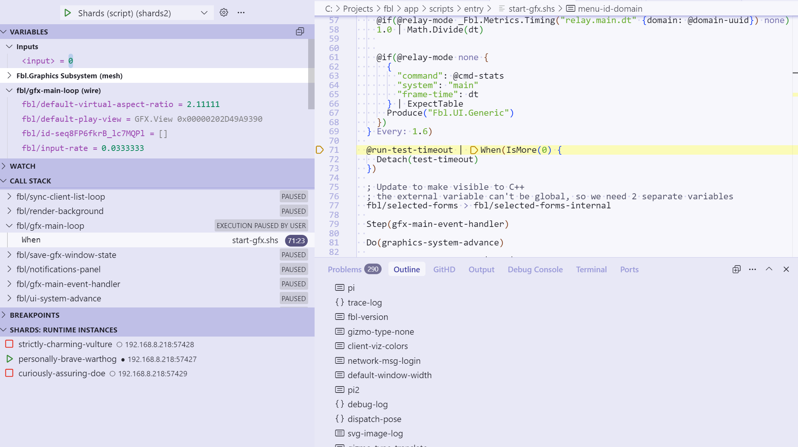

# vscode-shards 

[Shards](https://github.com/fragcolor-xyz/shards) language support for Visual Studio Code.




## Key Features

- **Syntax Highlighting** - Rich syntax highlighting for `.shs` files
- **Go to Definition** - Navigate to wire definitions, @define, @template, macro, and mesh declarations
- **Document Outline** - View and navigate meshes and wire definitions in the outline
- **Debugging Support** - Debug Shards programs directly in VS Code
- **Cross-file Navigation** - Jump to definitions across multiple files

## Quick Setup

1. **Install the extension** from the [VS Code Marketplace](https://marketplace.visualstudio.com/items?itemName=fragcolor.shards) or run:
   ```
   code --install-extension fragcolor.shards
   ```

2. **Configure Shards path** in VS Code settings:
   - Open Settings (Ctrl+,)
   - Search for "shards"
   - Set `shards.shardsPath` to your Shards executable path, for example:
     ```json
     "shards.shardsPath": "C:/Projects/shards/build/clang-x86_64-pc-windows-msvc/debug/shards.exe"
     ```

3. **Start using** - Open any `.shs` file to activate the extension

## Features Overview

- **Syntax Highlighting** - Rich syntax highlighting with proper tokenization
- **Go to Definition** - Navigate to definitions for wires, @define, @template, macro, and mesh
- **Document Outline** - Browse code structure with meshes and wire definitions
- **Cross-file Support** - Navigate definitions across multiple files

## Development

For developers wanting to contribute or modify the extension:

1. Install dependencies: `npm install`
2. Compile in watch mode: `npm run compile`
3. Debug: Go to _Run_ → _Start Debugging_ to test the extension

The extension is built with TypeScript and includes:
- Syntax highlighting via TextMate grammar
- Language features (go-to-definition, outline, debugging)
- Integration with the Shards executable

## Contributing

Contributions are welcome! Feel free to open an issue or submit a pull request.

To share this extension with the world, read on about [publishing an extension](https://code.visualstudio.com/api/working-with-extensions/publishing-extension).

## [LICENSE](LICENSE)

_vscode-shards-syntax_ source code is licensed under the [BSD 3-Clause license](LICENSE).
